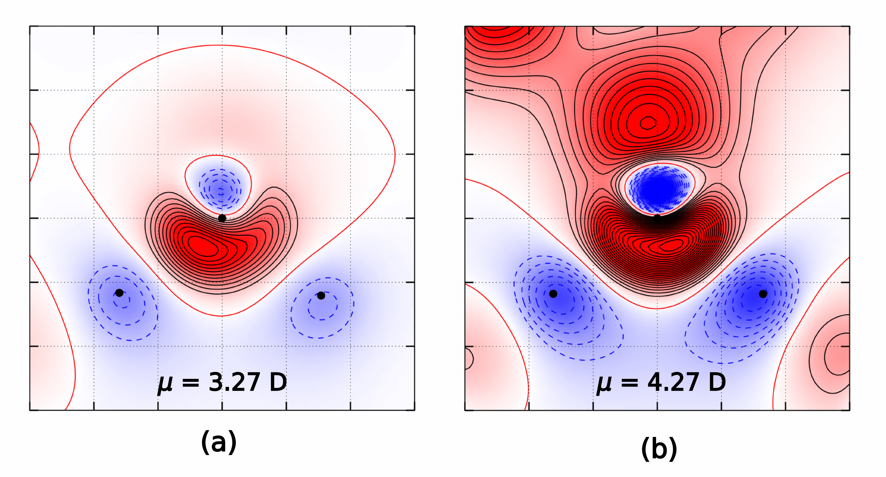

# Multiple files - VASP CHGCAR difference
From time to time, I need to calculate electron charge difference that is tabulated on a regular 3D grid. Common examples in my field will be Gaussian [.cube](http://paulbourke.net/dataformats/cube/) files or VASP [CHGCAR](http://cms.mpi.univie.ac.at/vasp/vasp/CHGCAR_file.html) files. One can find some scripts, tools and programs that can do this in one way or another. In my case, again, I need something slightly different and... Well, doing it with awk is so simple that I never use other tools but the one I will mention here. With small changes I am able to subtract 6 files at the same time, and since the files tend to be large, I keep them compressed.

Some advantages of the script are:

* extremely small memory footprint (_the calculation is done line by line_)
* it does not need to know anything about the format, it only expects that all files have the same number of grid points (_in each direction_)
* the number of atoms in the CHGCAR could be different

!!! note "VASP-CHGCAR-diff.awk"
    ``` awk
    #!/usr/bin/awk -f
    
    BEGIN {
      cmd1= "bzcat  "ARGV[1];
      cmd2= "bzcat  "ARGV[2];
      cmd3= "bzcat  "ARGV[3];
    
      NF=1;  while(NF>0){ cmd2 |& getline;       } cmd2 |& getline;
      NF=1;  while(NF>0){ cmd3 |& getline;       } cmd3 |& getline;
      NF=1;  while(NF>0){ cmd1 |& getline; print } cmd1 |& getline; print;
    
      do {
        cmd1 |& getline; split($0,d1)
        cmd2 |& getline; split($0,d2)
        cmd3 |& getline; split($0,d3)
        for(i=1;i<=NF;i++) printf "%18.11e ", d1[i]-d2[i]-d3[i]
        print""
      } while ($1*1==$1)
    
    }
    ```

`cmd1`, `cmd2` and `cmd3` are the commands that will read the compressed files.

`#!awk NF=1;  while(NF>0){ cmd2 |& getline;       } cmd2 |& getline;`   will fast forward to the grid data. The lines in the first file will be used as first lines in the new file.  
The rest is just reading line by line and calculating the difference column by column until it reaches the end of the file.

And here are some charge difference plots produced with Python :smile:



!!! example "Files"
    * [VASP_CHGCAR_diff.awk](../data/VASP_CHGCAR_diff.awk)
    * [plot-plane-v01.py](../data/plot-plane-v01.py)
  
