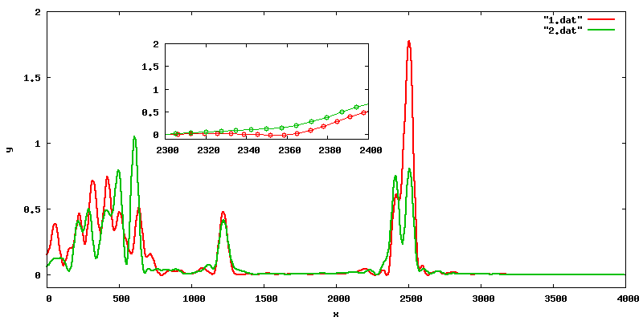

# Linear interpolation

Here is a problem that occurs often. One have a set of data files that contain 2 columns (x and y) for some calculated property. Here I have selected only two such sets.



I want to be able to add them, subtract them or make an average. So, what is the problem? 
The problem is, that the data is sampled in the same region but on different grids i.e. the number of points is different.

=== "1.dat"
    ```
       0.00    0.151576740
       6.51    0.157566880
      13.03    0.175107240
      19.54    0.202843140
    ...
    3967.59   -0.000073200
    3974.10   -0.000082352
    3980.62   -0.000095120
    3987.13   -0.000107504
    ```

=== "2.dat"
    ```
       0.00    0.060664982
       7.41    0.063726254
      14.83    0.072136290
      22.24    0.083837971
    ...
    3965.71   -0.000059534
    3973.12   -0.000055689
    3980.53   -0.000048746
    3987.94   -0.000041886
    ```

One needs to have the values on the same grid to make some simple calculations. I am interested in the region x in [1500:4000] and with a small awk script I can do on-the-fly linear interpolation (which is good enough in this particular case). Here is how the interpolated data compares to the original.

=== "1_new.dat"
    ```
    1500 0.00488383
    1501 0.0050328
    1502 0.00518177
    1503 0.00533075
    ...
    ```
=== "2_new.dat"
    ```
    1500 0.00410784
    1501 0.00411207
    1502 0.0041163
    1503 0.00412054
    ...
    ```

The script is running over integer numbers for easier understanding, but could be easily modified to handle real numbers for the grid values.


!!! example "interpolate-on-regular-grid.awk"
    ``` awk
    #!/usr/bin/awk -f
    BEGIN {
      minx= 1500;  # Range: lower limit
      maxx= 4000;  #        upper limit
      dx= 1;       #        increment
    }
    
    {
      # check if the lower limit has been reached
      if (($1 > minx ) && ($1 < maxx)){
        x2=$1; y2=$2;
    
        # for the defined range
        for (xi= minx; xi <= maxx; xi= xi+dx){
          # step forward if the current grid point is outside the [x1:x2] region
          if (xi > x2)  {
            while (($1<xi) && (getline!=0) ) {x1=x2; y1=y2; x2=$1; y2=$2}
          }
          yi= (y2-y1)/(x2-x1)*(xi-x1) + y1; # linear interpolation
          print xi, yi
        }
      }
      x1= $1; y1=$2
    }
    ```


Here is the result:


!!! warning
    I have written the script for my purposes and tested it against my data. It works for all of my cases, but could fail in some unforeseen situations so, please, always make sure that your results are reasonable. Do not blindly use the scripts provided on this site.

!!! example "Files"
    * [interpolate-on-regular-grid.awk](../data/interpolate-on-regular-grid.awk)
    * [1.dat](../data/1.dat)
    * [2.dat](../data/2.dat)
    * [1_new.dat](../data/1_new.dat)
    * [2_new.dat](../data/2_new.dat)

