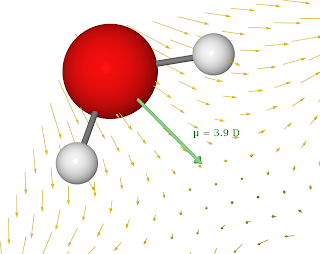
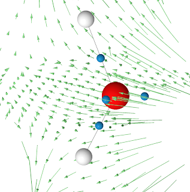

# Awk and Jmol 
{ align=right }

I have a structure that I can easily visualize with Jmol and I want to plot vectors at each atom. Here I am giving an example with Jmol, but the concept is the same for any other program. The command to plot such vectors with Jmol is 

``` java
draw ID vector (atomno=1) {x,y,z}
```

For larger molecules this quickly becomes quite a tedious work to type all this commands... so let awk write it for us.  
The output is printed to the sceen and saved in file `vectors.spt` that will later run in Jmol.

``` awk hl_lines="1"
$ awk '{i++;printf ("draw v%i vector (atomno=%i) {%f,%f,%f}\n",i,i,$1,$2,$3)}' vectors.dat | tee vectors.spt

draw v1 vector (atomno=1) {-0.500000,0.700000,0.700000}
draw v2 vector (atomno=2) {0.500000,-1.000000,0.900000}
draw v3 vector (atomno=3) {0.500000,-0.500000,0.900000}
```

where `vectors.dat` contains our vectors (x,y,z)

!!! note "vectors.dat"
    ```
    -0.5   0.7  0.7
     0.5  -1.0  0.9
     0.5  -0.5  0.9
    ```

The Jmol script that creates the figure above looks like this (in red is the line that loads the awk generated commands)
``` java hl_lines="14"
# load the molecule
load "1.xyz"

# save the status, orianation etc.
center {6.285864 6.6071978 6.971991};
   moveto -1.0 {0 0 1 0} 100.0 0.0 0.0 {6.285864 6.6071978 6.971991} 2.1566827 {0 0 0} 0 0 0 3.0 0.0 0.0;
  save orientation "default";
  moveto 0.0 { -488 825 -286 58.44} 100.0 0.0 0.0 {6.285864 6.6071978 6.971991} 2.1566827 {0 0 0} 0 0 0 3.0 0.0 0.0;;

wireframe 0.1
set perspectiveDepth  FALSE

# load the file generated with awk
script "vectors.spt"

write image  200 200 png "molecule.png"
```

Here are few more plots generated the same way.

{ align=left }
{ align=right }
<br/>
<br/>
<br/>
<br/>
<br/>
<br/>
<br/>
<br/>
<br/>
<br/>
<br/>
<br/>
<br/>
<br/>


Of course, you can use the same "trick" to change colors, sizes, or any other properties by generating instructions with simple awk scripts.
