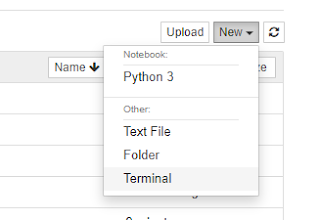

# GitHub & Binder
---
You can download most of the example data and scripts from Github [https://github.com/pmitev/to-awk-or-not page](https://github.com/pmitev/to-awk-or-not)

``` bash
git clone --depth=1 https://github.com/pmitev/to-awk-or-not.git
```
{ align=left } Start a Binder virtual environment for the course with all GitHub files available (click on this [link](https://mybinder.org/v2/gh/pmitev/to-awk-or-not/master) ).

<br/>
<br/>
{ align=right } "New/Terminal" from the drop-down menu on the top-right of the page.
When the Virtual environment is ready and running, choose 
